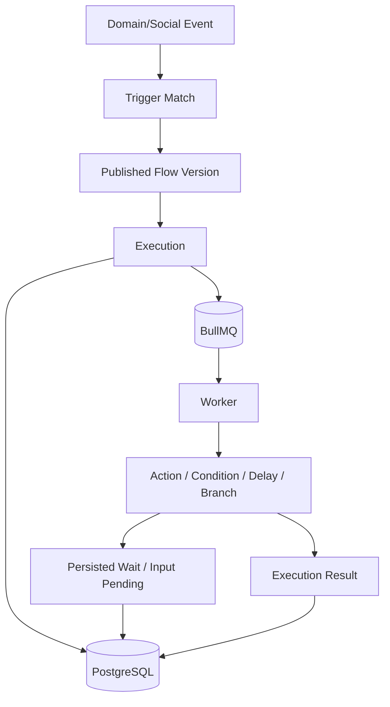

# Automation Architecture

Automation is infrastructure, not page-specific UI logic.

## Core concepts

- Automation.
- Flow.
- Trigger.
- Action.
- Execution.
- Interaction.

## Versioning

An automation being edited must not mutate the exact structure being executed by active executions.

Conceptual model:

```text
Automation
-> Draft Flow Version
-> Published Flow Version
-> Execution references Published Version
```

There is one canonical automation runtime.

Avoid duplicate workflow engines.

## Runtime diagram



## Execution requirements

Runtime must support:

- Trigger.
- Action.
- Condition.
- Delay.
- Waiting input.
- Branching.
- Tags.
- Outbound response.
- External actions.
- User interaction continuation.

Long waits must not require long-running processes.

Persist runtime state and resume asynchronously.

## Idempotency

Automation retries must not accidentally send duplicate actions.

Use execution IDs, step IDs, idempotency keys, and persisted state transitions.
