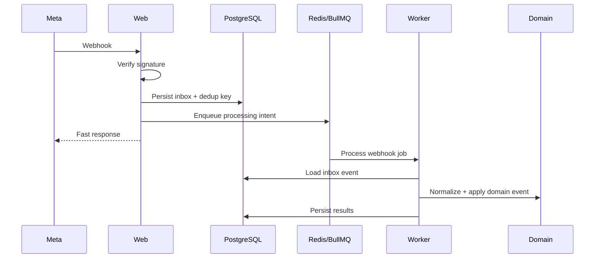

# Integration Architecture

## Provider boundary

Provider-specific payloads and clients live behind integration boundaries.

Do not embed Meta-specific payload structure throughout the application.

Normalize provider payloads at the integration boundary.

## Meta webhook processing

Webhook endpoints must:

- Respond quickly.
- Verify authenticity.
- Avoid heavy synchronous processing.
- Be idempotent.

## Social Connection vs Page

Social Connection is provider/account authorization.

Page is a social destination/entity managed by the product.

Social Connection owns provider token relationship and lifecycle.

Page owns social destination context and product usage.

## Future providers

Social Presence must support future providers without pretending all providers behave identically.

Provider differences stay behind explicit capabilities and normalized contracts.
