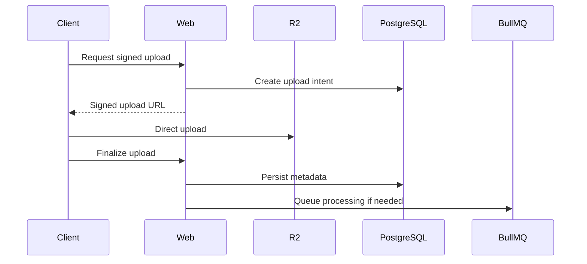
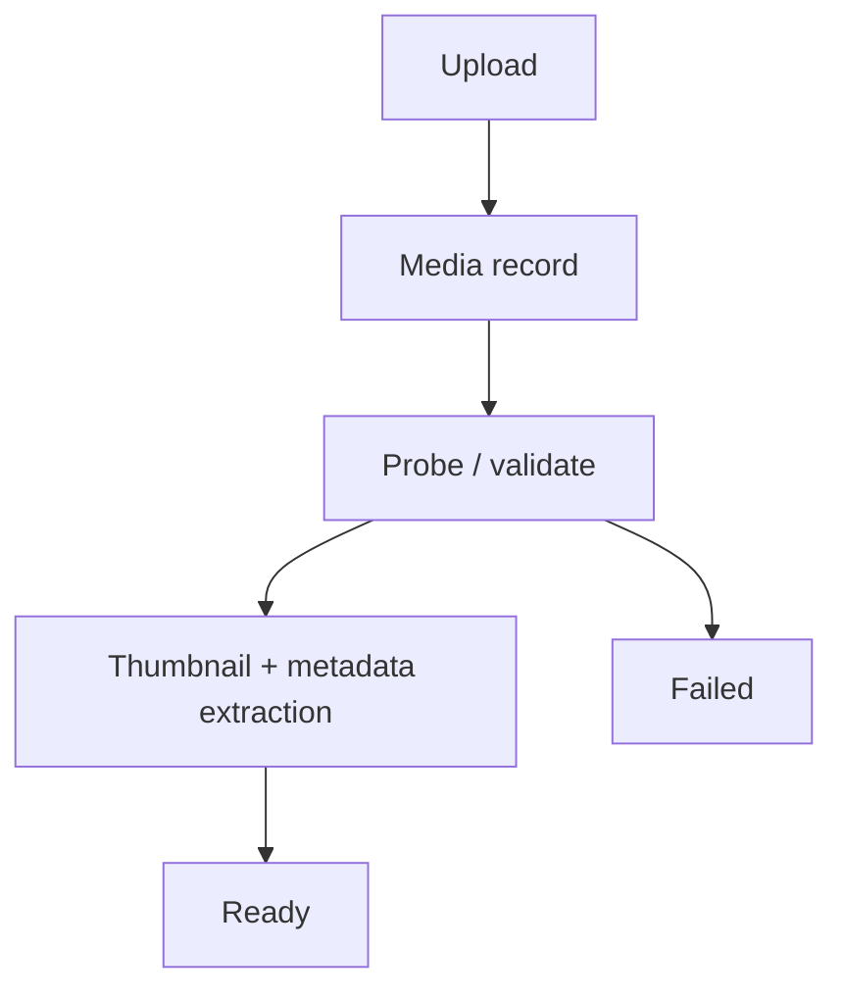
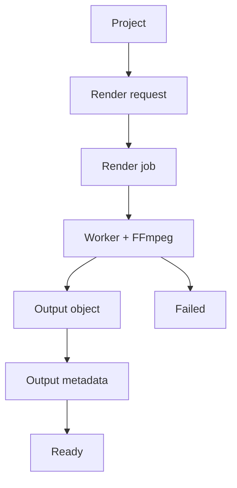

# Media Pipeline Architecture

## Storage

Use object storage for binary/media data.

Preferred direction: Cloudflare R2.

R2 stores:

- Uploaded video.
- Uploaded images.
- Audio.
- Render outputs.
- Thumbnails.
- Derived media.
- Temporary processing artifacts where necessary.

PostgreSQL stores metadata and references, not large binary payloads.

Original media and derived media must be distinguishable.

## Direct upload flow

Avoid routing large media uploads through the Next.js server.

## Media processing

## Creative output

## Studio architecture

Video/Image Studio works around:

- Project.
- Assets.
- Composition/configuration.
- Preview.
- Output.
- Publish handoff.

Editing configuration should be declarative where possible.

Browser may perform lightweight previews/interactions.

Production rendering must be deterministic and worker-controlled when final render is required.

## FFmpeg

FFmpeg belongs in the Worker environment with sufficient temp disk, longer execution, retries, concurrency controls, and memory/CPU limits.
