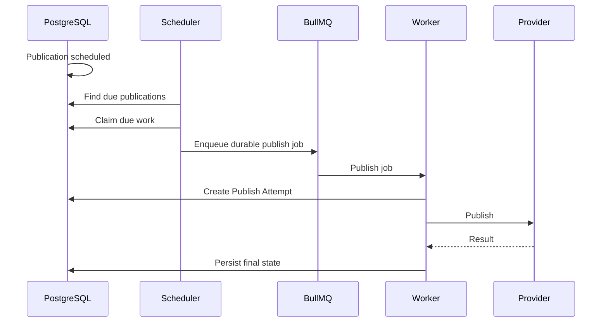

# Publishing Architecture

## Core concepts

- Publication: intent/configuration.
- Target: destination.
- Publish Attempt: actual external attempt.
- Published Content: successful external publication.

These distinctions must remain explicit.

## Scheduled publishing

PostgreSQL is the source of truth for schedules.

Do not rely exclusively on a delayed Redis job months into the future.

If Redis is lost, scheduled publications remain recoverable from PostgreSQL.

## Retry policy

Retryable:

- Temporary provider outage.
- Rate limiting.
- Transient network failure.

Permanent:

- Revoked connection.
- Invalid media.
- Unsupported provider state.
- Deleted destination.

Do not retry permanent failures indefinitely.

## Idempotency

Publication attempts must not accidentally create duplicate posts.

Use idempotency keys where providers support them and persist provider response identifiers.
