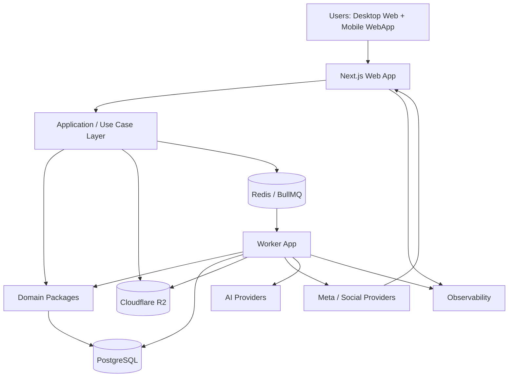
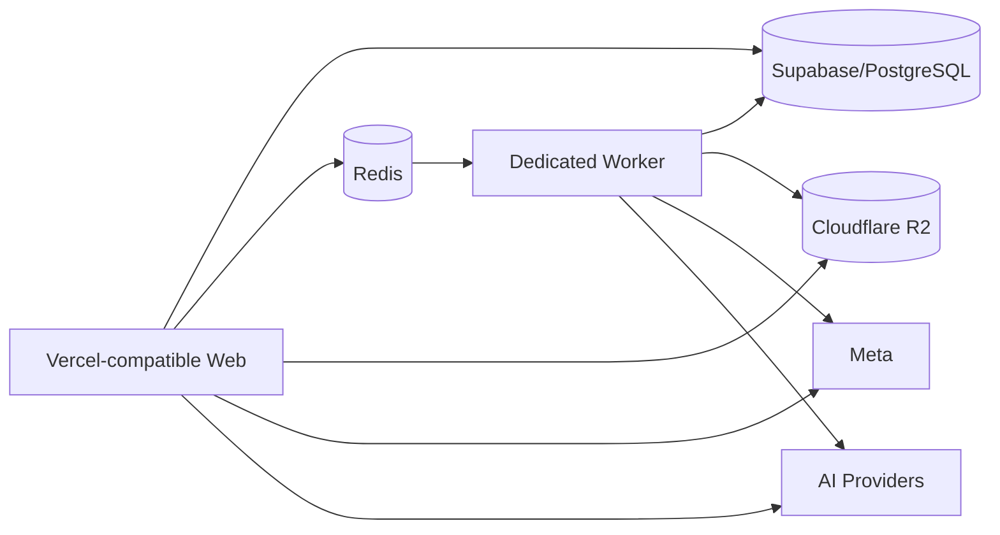

# System Context

## System context

## Runtime topology

## Responsibility split

Web orchestrates user requests, authentication, authorization, validation, and job intent creation.

Worker executes background workloads such as media processing, publishing, automation execution, AI generation, analytics aggregation, cleanup, and synchronization.

PostgreSQL remains authoritative for product state.

Redis/BullMQ coordinates execution but does not own business truth.
