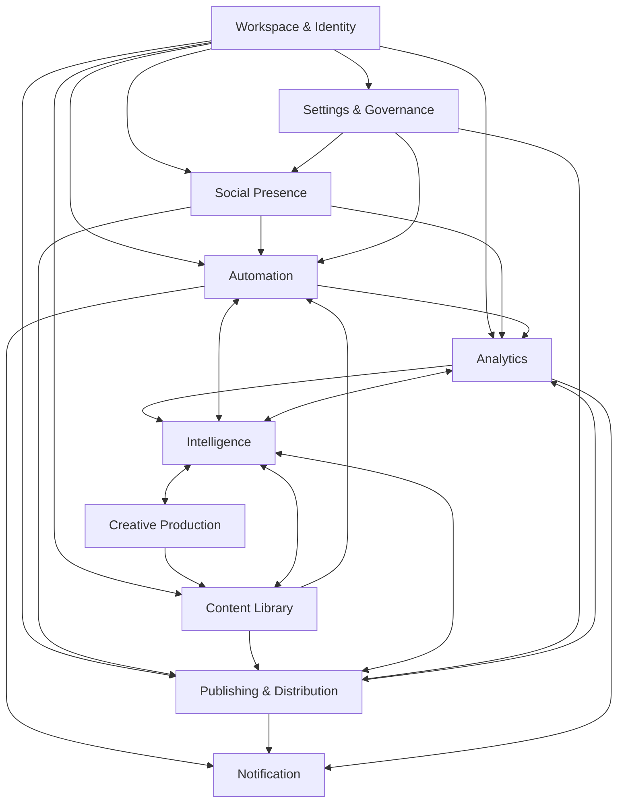

# Domain Map

## Consolidated domains

M001 consolidates overlapping concepts into these product domains:

1. Workspace & Identity
2. Social Presence
3. Content Library
4. Creative Production
5. Automation
6. Publishing & Distribution
7. Analytics
8. Intelligence
9. Notification
10. Settings & Governance

## Visual map

## Domain responsibilities

### Workspace & Identity

- Purpose: define the operating container and people participating in it.
- Owns: Workspace, User, Member, ownership context.
- Does not own: social pages, content, publishing, analytics, or detailed permissions design.
- Interacts with: all domains.
- Key concepts: Workspace, User, Member, Owner.
- Major events: workspace created, member invited, member removed, ownership changed.

### Social Presence

- Purpose: represent external social platforms, connections, and pages available to the operation.
- Owns: Social Connection, Page, connection status, page availability.
- Does not own: content creation, publishing attempts, platform metrics interpretation.
- Interacts with: Publishing & Distribution, Automation, Analytics, Settings & Governance.
- Key concepts: Account, Connection, Page, Target.
- Major events: connection added, connection expired, page discovered, page disconnected.

### Content Library

- Purpose: hold reusable content and content-related inventory.
- Owns: Media, Asset, Content, Variant, Output as product concepts.
- Does not own: editing workflow details, publication delivery, analytics interpretation.
- Interacts with: Creative Production, Publishing & Distribution, Automation, Analytics, Intelligence.
- Key concepts: Media, Asset, Content, Variant, Output.
- Major events: media added, content drafted, variant created, output prepared.

### Creative Production

- Purpose: create and transform video, image, and template-based work.
- Owns: Project, Video Project, Image Project, Render, creative Template.
- Does not own: final publishing state or platform metrics.
- Interacts with: Content Library, Templates, Intelligence.
- Key concepts: Project, Video, Image, Template, Render.
- Major events: project created, asset transformed, render completed, template reused.

### Automation

- Purpose: define operational behavior from events to execution results.
- Owns: Automation, Flow, Trigger, Condition, Action, Wait, Branch, Execution.
- Does not own: social account connection, content ownership, raw analytics collection, or publishing delivery.
- Interacts with: Social Presence, Content Library, Publishing & Distribution, Analytics, Notification, Intelligence.
- Key concepts: Trigger, Condition, Action, Wait, Branch, Flow, Execution, Interaction.
- Major events: trigger matched, execution started, action completed, branch selected, execution failed, execution completed.

### Publishing & Distribution

- Purpose: deliver content to one or more targets over time.
- Owns: Publication, Target selection, Schedule, Publish Attempt, Published Content.
- Does not own: content source assets, social connection authorization, analytics interpretation.
- Interacts with: Content Library, Social Presence, Automation, Analytics, Notification.
- Key concepts: Publication, Target, Schedule, Attempt, Published Content.
- Major events: publication scheduled, publication canceled, attempt started, attempt failed, attempt succeeded.

### Analytics

- Purpose: measure and explain performance across the operation.
- Owns: Normalized Metric, Product Analytics, Automation Analytics, Content Performance, Operational Analytics.
- Does not own: executing automations, publishing delivery, or social connection setup.
- Interacts with: Social Presence, Content Library, Automation, Publishing & Distribution, Intelligence.
- Key concepts: Raw Platform Metric, Normalized Metric, Metric, Insight.
- Major events: metric collected, metric normalized, insight generated, performance anomaly detected.

### Intelligence

- Purpose: provide AI-assisted capabilities across product domains.
- Owns: assistance intents such as Generate, Analyze, Recommend, Optimize, Classify, Summarize, Assist, Transform.
- Does not own: a separate AI product surface, provider selection, model selection, or technical orchestration.
- Interacts with: all domains where assistance is useful.
- Key concepts: Recommendation, Suggestion, Generated Draft, Optimization.
- Major events: recommendation created, content generated, item classified, optimization suggested.

### Notification

- Purpose: inform users about meaningful operational events.
- Owns: Notification, Alert, Approval request, status signal.
- Does not own: the underlying event source or domain state.
- Interacts with: Publishing & Distribution, Automation, Analytics, Settings & Governance.
- Key concepts: Notification, Alert, Approval, Digest.
- Major events: notification created, notification read, approval requested, alert resolved.

### Settings & Governance

- Purpose: configure the operating rules of the workspace and domains.
- Owns: workspace settings, governance settings, configuration surfaces.
- Does not own: product execution in configured domains.
- Interacts with: all configurable domains.
- Key concepts: Setting, Policy, Configuration.
- Major events: setting changed, policy enabled, configuration validated.
